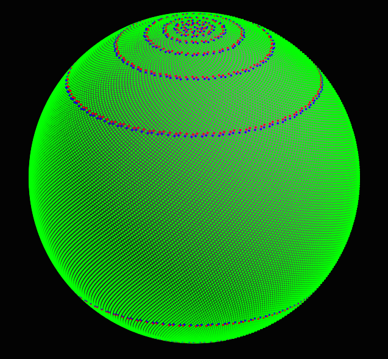
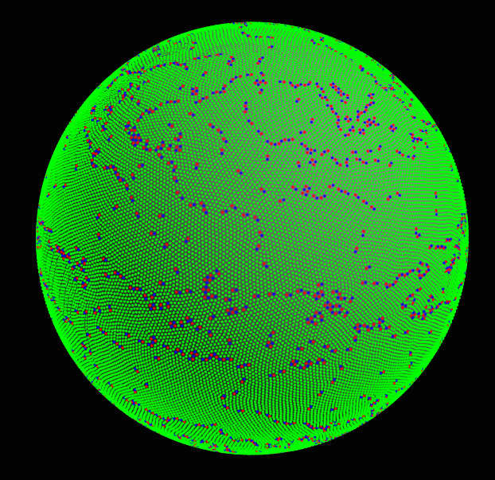
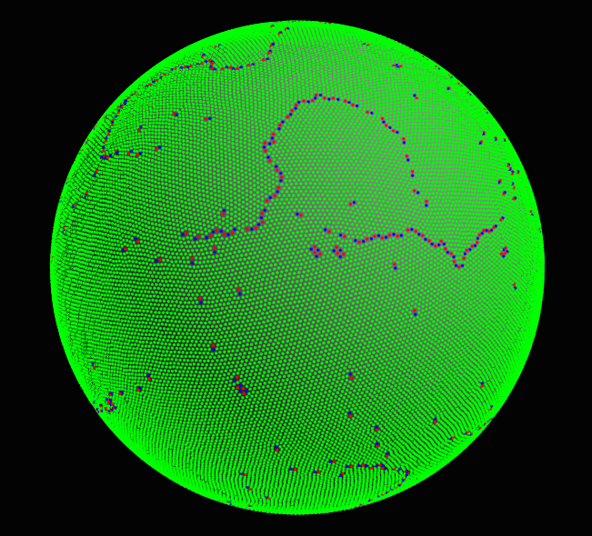
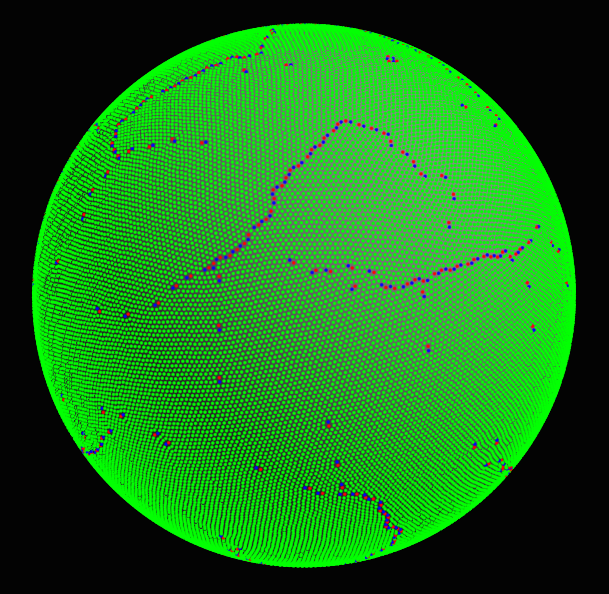
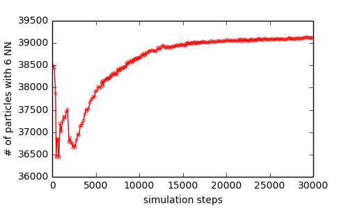

Docker image at https://hub.docker.com/r/tscheff/davis/

# Molecular Dynamics Simulation on a Sphere

Tim Scheffler, 2015.

This is a Python/C project to demonstrate molecular dynamics 
simulation on a sphere. The particles interact via a cutoff Coulomb potential.
A damping force proportional to the relative velocities of interacting
particles will be used to dissipate energy and to cool down the system in
order to approach a configuration of minimal energy. This ground state
should then give the optimal packing of N particles on a sphere. 

##  Dependencies

* Python 2.7
* A C-Compiler
* SciPy
* PyOpenGL

Tested on OS X 10.10.2 and Linux Mint 17.1 Cinnamon 64-Bit.

## Building

`$ python setup.py build_ext -i`

## Usage

Start the simulation with 

`$ python davis.py`

Parameters (like e.g. number of particles or the number of used CPU cores) 
are setup as global variables at the top of `davis.py`.

With focused OpenGL window you can drag the mouse (while clicking)
to rotate the sphere. Use the following keys to control the simulation:

* "g": start/pause the simulation
* "q": quit

The simulation writes a a file `davis_observables.csv` containing
in each row the following data:

* number of steps
* potential energy
* number of particles with 6 nearest neighbours 
* number of particles with less than 6 nearest neighbours 
* number of particles with more than 6 nearest neighbours 

This `csv`-File can be plotted with

`$ python plot.py davis_observables.csv`

Please be aware, that there is no error handling in the C part. If something bad
happens, like malloc can not get enough memory or there is a negative 
argument for the `sqrt` function, the program crashes hard.  In that case
try a simulation with less particles or smaller time step.

## Simulation technique

This is a molecular dynamics simulation using
the _velocity verlet algorithm_[1] for time integration. We make the
lookup of interacting particles more efficient with a _linked list cell algorithm_[1]. Keeping
the particles constrained to the surface of the sphere is done via
the _RATTLE algorithm_[2], which can be solved analytically for this simple constraint.

The simulation is purely three-dimensional: all particles have 3d vectors
for position, velocity and acceleration. In principle, as the particles
are constrained to the surface of the sphere, the system is two-dimensional,
but simulating the two-dimensional manifold is more complicated[3] than just
using the embedding three-dimensional space for simulation. Doing so
we can also use the simple 3d linked cell algorithm for neighbour lookup, although
most of the 3d cells will be empty. Additionally, 
we could use this code for simulation of other constraining surfaces.

The particle interaction is a cutoff Coulomb potential of the form: 

    V(r) = 1/r + r/r_c^2 - 2/r_c   for r < r_c
           0                       otherwise

where `r` is the distance between interacting particles and `r_c`
is the cutoff-distance. The coulomb force is three-dimensional, meaning
`r` is just the euclidean distance `r = sqrt(dx^2 + dy^2 + dz^2)` between
two particles.

The forces between the particles are always repelling, but this is 
not a problem as the system is confined to the surface of the sphere.
In the ground state the overall distance of the particles would reach
a maximum. This would yield in a flat geometry a perfect hexagonal lattice,
meaning that each particle would have exactly six nearest neighbours.

In a non-flat two-dimensional space, like the surface of the sphere, a 
perfect hexagonal lattice cannot be established and there are particles
with more or less than six nearest neighbours. (See: _Euler Poincaré_ relation.)

During the simulation we will observe a system cooling down and 
(hopefully) approaching the ground state. In order to measure the 
development we will count the number of particles, that have exactly six neighbours.
For this we use the [qhull](http://www.qhull.org/) implementation from 
[scipy](http://docs.scipy.org/doc/scipy/reference/generated/scipy.spatial.ConvexHull.html#scipy.spatial.ConvexHull). 

In the OpenGL window all particles having six neighbours are coloured **green**, 
particles having less than six neighbours are coloured **blue**, more than six **red**.

For the initial configuration it is important, that the particles are not
too close, because the Coulomb potential can become so large, that the
simulation gets unstable. Therefore we use the method of [Fibonacci spheres](https://stackoverflow.com/questions/9600801/evenly-distributing-n-points-on-a-sphere/26127012#26127012) for a good first configuration.

For more information about Coulomb particles on curved surfaces, please see
the talk by Paul Chaikin ["Classical Wigner Crystals on flat and curved surfaces"](https://www.youtube.com/watch?v=Wko67TCla74).

## External sources

The basis for the OpenGL visualisation is taken from ["Adventures in OpenCL"](https://github.com/enjalot/adventures_in_opencl/tree/master/python/part2) tutorial series by Ian Johnson. 

## License

MIT license

Copyright(c) 2015 Tim Scheffler

Some of the code is
taken from other sources, and there should be a link to the original source.

## Example Simulation

We have N = 40000 particles.

Initial configuration after placing 40000 particles with the 
[Fibonacci spheres](https://stackoverflow.com/questions/9600801/evenly-distributing-n-points-on-a-sphere/26127012#26127012) method:

(Particles having six neighbours are coloured **green**, 
particles having less than six neighbours are coloured **blue**, more than six **red**.)

After 660 simulation steps. The global structure of the initial configuration breaks apart:

After 2317 simulation steps:

After 13020 simulation steps:

Configuration after 29918 simulation steps:

After comparison of the last two configurations one sees, that the
number of single islands is reduced and the strings become more flat.
Strings ("scars") like these are discussed in the talk by 
[Paul Chaikin](https://www.youtube.com/watch?v=Wko67TCla74).

If we now plot the development of the number of particles with 
six nearest neighbours against time, we get the following plot

Here we see, that initially after placing the particles with the 
Fibonacci spheres method the distribution is already quite good. After
starting the dynamics the global structure from the Fibonacci spheres is 
destroyed and we temporarily get a configuration with worse NN (Nearest Neighbour) 
distribution. But after that, the system slowly approaches the optimal configuration
as it cools down. Hereby the approach to the ground state gets slower and slower.

## References

[1]: M.P. Allen, D.J. Tildesley,
_"Computer Simulation of Liquids"_,
(Oxford Scientific Publications, 1987)

[2]: H.C. Andersen, 
_"Rattle: A 'Velocity' Version of the Shake Algorithm for Molecular Dynamics Calculations"_,
Journal of Computational Physics **52**, (1983) 24

[3]: See for example the appendix A of J.-P. Vest, G. Tarjus, P. Viot,
_"Dynamics of a monodisperse Lennard-Jones system on a sphere"_,
arXiv:1401.7168v1 [cond-mat.stat-mech]
